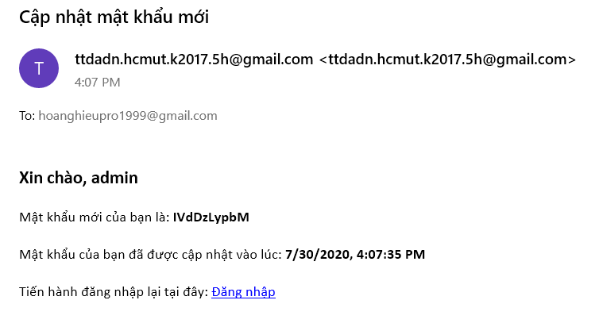
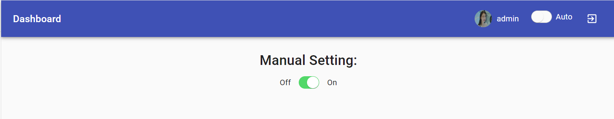

# TTDADN Frontend

GIỚI THIỆU ĐỀ TÀI
=================

Lý do chọn đề tài
-----------------

Internet of Things (IoT) là xu hướng đang được các doanh nghiệp trong
lĩnh vực công nghệ quan tâm và đầu tư nghiên cứu. Cuộc đua IoT đã và
đang diễn ra mạnh mẽ giữa các doanh nghiệp trên toàn thế giới. Theo
Gartner, đến năm 2020, thế giới sẽ có khoảng 20 tỷ thiết bị sử dụng IoT,
doanh số dự kiến trong năm là 437 tỷ USD. Nắm bắt được nhu cầu đó và kết
hợp yêu cầu của môn học nhóm chúng em đã cho phát triển một ứng dụng IoT
là một hệ thống điều khiển phơi đồ thông minh. Hệ thống được thiết kế
hợp lý với mong muốn được tiếp cận đến với nhiều người dùng nhất có thể.

Mô tả nội dung đề tài
---------------------

Xây dựng hệ thống phơi đồ thông minh,điều khiển hoạt động phơi đồ thông
qua thông số do các sensor trả về và ngưỡng thiết lập bởi người dùng.

### Chức năng chung của ứng dụng

Hệ thống sẽ nhận dữ liệu về nhiệt độ, độ ẩm và ánh sáng từ server gửi
về, lưu trữ dữ liệu vào database đồng thời xử lí dữ liệu đó với các
ngưỡng mà người dùng đã thiết lập.\
\
Sau đó ứng dụng sẽ gửi yêu cầu cho serve, motor tiến hành việc thu đồ
vào hoặc sẽ đem ra phơi phụ thuộc vào việc xử lí dữ liệu ở trên.\
\
Ngoài ra người dùng là admin còn có thể chủ động kéo cây phơi đồ ra vào
mà không cần phụ thuộc vào ngưỡng hay sensors.

### Một số tính năng bổ sung của ứng dụng

Đăng ký, đăng nhập, thay đổi thông tin cá nhân\
\
Thiết lập ngưỡng, chọn các ngưỡng đã được thiết lập trước đó.\
\
Biểu đồ biểu diễn và cập nhật số liệu mới nhất về nhiệt độ, độ ẩm, ánh
sáng theo giờ, ngày, tuần, tháng.\
\
Gửi thông báo bằng email đã đăng kí cho người dùng khi cây phơi đồ thay
đổi trạng thái.

Các thiết bị sử dụng:
---------------------

Bảng thiết bị:
<table>
    <tr>
        <th>Số thứ tự thiết bị</th>
        <th>Tên thiết bị</td>
    </tr>
    <tr>
    <td>5</td>
    <td>Nhiệt độ - độ ẩm không khí</td>
    </tr>
    <tr>
    <td>6</td>
    <td>Cường độ ánh sáng</td>
    </tr>
    <tr>
    <td>9</td>
    <td>Motor và động cơ ( Theo cập nhật mới nhất là loa )</td>
    </tr>
</table>

THIẾT KẾ HỆ THỐNG
=================

Phân tích các yêu cầu chức năng:
--------------------------------

1.  Đăng ký, đăng nhập, thay đổi mật khẩu, tìm lại mật khẩu.

2.  Cập nhật thông tin các nhân, thay đổi thông tin cá nhân.

3.  Nhận dữ liệu từ các sensors thông qua mqtt chạy tự động ở server
    backend của nhóm.

4.  Lưu trữ dữ liệu của các sensors vào trong database.

5.  Hiển thị dữ liệu lên màn hình.

6.  Phân tích dữ liệu ra đồ thị và hiển thị lên màn hình theo thời gian
    thực.

7.  Lưu trữ dữ liệu của các thông số người dùng điều chỉnh trong
    database.

8.  Xử lý dữ liệu và đưa ra quyết định kéo cây phơi đồ ra hay vào.

9.  Ngưỡng phơi đồ được điều chỉnh bởi người dùng.

10. Điều chỉnh auto phơi đồ, hoặc phơi đồ theo điều khiển của người
    dùng.

11. Gửi lại yêu cầu tắt mở motor thông qua mqtt ở server backend mỗi khi
    vượt ngưỡng ở chế độ auto hoặc người dùng điều khiển.

12. Gửi email đến người dùng về thông số hiện tại (nếu tính năng này
    được chọn) mỗi khi cây phơi đồ thay đổi trạng thái.

Phân tích các yêu cầu phi chức năng:
------------------------------------

1.  Người dùng chỉ được sử dụng được phần mềm sau khi đăng nhập.

2.  Người dùng có thể sử dụng hệ thống ngay lập tức không cần training.

3.  Hệ thống hoạt động liên tục 24/7 trong trạng thái bình thường.

4.  Tất cả các sensors có thể hoạt động cùng lúc.

5.  Thời gian gửi email thông số không quá 5 phút trong trạng thái bình
    thường.

6.  Giao diện thân thiện (Đo qua phản hồi của 100 người dùng khi khảo
    sát với mức đánh giá trung bình tối thiểu là 8/10).

Sơ đồ Use-Case và mô tả:
------------------------

### Quản lý đăng nhập

### Chức năng của người dùng

### Thiết lập ngưỡng và điều khiển sào phơi đồ:

### Xem dữ liệu do sensor trả về

Thiết kế cơ sở dữ liệu
----------------------

### Database diagram

 Chú thích: Kiểu dữ liệu sử dụng trong database diagram
trên là của Sequelize, ví dụ sequelize.STRING chứ không phải VARCHAR như
của SQL.

Và kết quả trên pgAdmin:\
\
Dữ liệu trong bảng data được cập nhật tự động
bằng cách subcribe vào mqtt broker của server nhóm CE, từ đó được thêm
mới vào liên tục. Trên đây là fake data nhóm thử nghiệm trên một server
tự tạo.

Những công nghệ sử dụng:
------------------------

-   Platform: để tiện lợi cho người dùng trong việc truy cập, nhóm chọn
    nền tảng Web để phát triển. Người dùng không cần phải tải xuống ứng
    dụng mà chỉ lần truy cập vào trang web là đã có thể sử dụng mọi nơi
    trên mọi thiết bị. Ngoài ra việc sử dụng responsive web thay cho
    mobile còn tiện lợi cho người dùng destkop, android lẫn iOS, giúp họ
    có thể sử dụng mà không cần phải phát triển độc lập từng nền tảng
    cũng như cho việc tạo ra sản phẩm đồng bộ hơn, nhanh hơn và ít tốn
    công sức hơn.

-   Front-end : sử dụng React.js như bộ công cụ tạo ra giao diện cho ứng
    dụng vì sự đa năng cũng như gọn nhẹ của nó. Ngoài ra việc module và
    tái sử dụng các thành phần của ReactJS cũng là một tính năng mạnh mẽ
    giúp code linh hoạt cũng như ít bị dư thừa hơn.

-   Back-end : Express.js là một framework dựa trên Node.js với tốc độ
    cao, có thể hỗ trợ 1 lần nhiều người dùng cùng lúc và đặc biệt là
    việc setup không quá phức tạp giúp đẩy nhanh tiến độ tạo ra sản
    phẩm.

-   Database : sử dụng Postgresql vì độ mạnh mẽ, nhanh chóng, đa dụng
    của nó trong việc sử dụng. Vì các dữ liệu có mối liên hệ với nhau (
    user, user-config, sensor ) thông qua id nên sử dụng dạng SQL sẽ
    tiện lợi trong việc truy xuất dữ liệu các bảng khác nhau.

-   Version Control System : nhóm sử dụng GitLab trong việc quản lý code
    của các thành viên để tạo nên sự đồng nhất trong code, hạn chế các
    conflict nhất có thể cũng như dễ dàng cho việc kiểm tra và quản lý
    các phiên bản.

-   Cloud Storage: Nhóm sử dụng Firebase Store để lưu hình ảnh của người
    dùng. Firebase Store giúp lưu trữ và chia sẻ nội dung do người dùng
    tạo ra như hình ảnh, âm thanh và video với bộ nhớ đối tượng mạnh mẽ,
    đơn giản và tiết kiệm chi phí được xây dựng cho quy mô của Google.
    Các Firebase SDK cho Cloud Storage thêm tính năng bảo mật của Google
    để tải lên và tải tệp cho các ứng dụng Firebase, bất kể chất lượng
    mạng.

-   Hosting: để đưa Front-end lên nền tảng web, nhóm dùng dịch vụ
    Firebase Hosting với ưu điểm là không tốn chi phí, có sẵn SSL cũng
    như tên miền tốt, đơn giản không phức tạp khi sử dụng.

-   Server Deploying: nhóm sử dụng Heroku để đưa Back-end lên cloud vì
    dễ sử dụng, tiện lợi và đặc biệt là miễn phí cho các ứng dụng tầm
    vừa và nhỏ mà không phải thiết lập phức tạp.

MÔ TẢ CHI TIẾT
==============

Màn hình đăng nhập:
-------------------

-   Người dùng khi đã có tài khoản ứng dụng rồi thì dễ dàng đăng nhập
    một cách nhanh chóng và dễ dàng.

-   Tiêu chí:

    -   Yêu cầu cần có Internet để có thể xác thực đăng nhập.

    -   Người sử dụng phải nhập đúng tài khoản đã được đăng ký.

    -   Email không được trống, mật khẩu có ít nhất 6 ký tự.

    -   Trường mật khẩu được mã hoá.

    -   Thông báo cho người dùng nếu không đăng nhập được.

Màn hình đăng ký:
-----------------

-   Người sử dụng lần đầu dễ dàng tạo tài khoản mới nhanh chóng và dễ
    dàng.

-   Tiêu chí:

    -   Yêu cầu cần có Internet để có thể xác thực đăng ký.

    -   Username dùng để đăng nhập.

    -   Các trường dữ liệu nhập vào không được trống và hợp lệ, email
        phải theo đúng định dạng, password phải đủ 6 ký tự.

    -   Email đăng ký chưa từng được sử dụng trong ứng dụng này, nếu
        đăng ký trùng email sẽ bị báo lỗi.

    -   Email đăng ký chưa từng được sử dụng trong ứng dụng này, nếu
        đăng ký trùng email sẽ bị báo lỗi.

Màn hình quên mật khẩu:
-----------------------

-   Người dùng lấy lại mật khẩu qua email đăng kí tài khoản.

-   Tiêu chí:

    -   Email phải đúng định dạng và đúng với tài khoản cần lấy lại mật
        khẩu.

-   Thông báo reset password thành công:

Màn hình đổi mật khẩu:
----------------------

-   Người dùng đổi mật khẩu sau khi nhập đầy đủ thông tin và nhấn “Save
    Change”

-   Tiêu chí:

    -   Người dùng phải nhập mật khẩu cũ chính xác.

    -   Người dùng phải nhập mật khẩu mới và xác nhận mật khẩu mới chính
        xác.
    
-   Sau khi thay đổi mật khẩu người dùng sẽ được chuyển đến trang login
    và phải tiến hành đăng nhập lại.

Màn hình đổi thông tin cá nhân:
-------------------------------

-   Người dùng có thể thay đổi thông tin gồm ảnh đại diện, email, tên
    đầy đủ, username.

-   Không cần thiết phải sửa đổi thông tin ở tất cả các trường, nếu thay
    đổi ở trường nào thì sửa ở trường đó.

-   Tiêu chí: Email phải đúng định dạng. Không được sử dụng email và
    username trùng với user khác.

    

Màn hình thiết lập ngưỡng và điều khiển phơi đồ
-----------------------------------------------

1. Thay đổi trạng thái sào phơi đồ bằng tay:

-   Thay đổi trạng thái sào phơi đồ:

-   Tiêu chí:

    -   Yêu cầu người dùng là admin và phải đăng nhập.

    -   Phải chọn chế độ điều khiển bằng tay.

2. Thông tin về thiết lập hiện tại trạng thái sào phơi đồ và bật tắt
thông báo:

-   Xem thông tin của lần thiết lập ngưỡng sau cùng của admin, trạng
    thái hiện tại của sào phơi đồ và bật tắt tính năng gửi email thông
    báo đến admin.

-   Tiêu chí:

    -   Yêu cầu người dùng đăng nhập là admin và phải bật chế độ điều
        chỉnh là auto.

3. Thiết lập ngưỡng:

-   Thiết lập ngưỡng nhiệt độ, độ ẩm, không khí.

-   Tiêu chí:

    -   Yêu cầu người dùng đăng nhập là admin và phải bật chế độ điều
        chỉnh là auto.

4. Lịch sử thiết lập ngưỡng:

-   Xem lịch sử các lần thiết lập ngưỡng, chọn để áp dụng hoặc xóa một
    ngưỡng đã thiết lập trước đó.

-   Tiêu chí:

    -   Yêu cầu người dùng đăng nhập phải là admin và phải bật chế độ
        điều chỉnh là auto..

5. Gửi email thông báo trạng thái phơi đồ:

-   Nhận email thống báo thay đổi trạng thái sào phơi đồ và một số thông
    tin liên quan như ngưỡng thiết lập, nhiệt độ, độ ẩm không khí.

-   Tiêu chí:

    -   Yêu cầu người dùng đăng nhập phải là admin và phải bật chế độ
        điều chỉnh là auto.

    -   Bật chế độ gửi email thông báo.

Màn hình xem dữ liệu do sensor trả về
-------------------------------------

-   Xem biểu đồ dữ liệu về nhiệt độ, độ ẩm và ánh sáng do sensor trả về.
    Biểu đồ có thể hiện rõ thời gian dữ liệu được nhận về.

-   Tiêu chí: Yêu cầu người dùng phải đăng nhập vào hệ thống.

Về MQTT Server
--------------

 Theo như mô tả tổng quan, server của nhóm sẽ hiện
thực 2 hàm chức năng. Broker nhóm sử dụng là của broker online của
hivemq mqtt để test, và server của CE.

-   Subscribe:

    -   Hàm này sẽ luôn chạy để subcribe vào topic 1 của broker mà
        server CE trả dữ liệu từ sensor về, đồng thời cập nhật dữ liệu
        đó liên tục vào table Data của nhóm.

    -   Kiểm tra các ngưỡng mà user thiết lập thông qua UserConfigs, nếu
        user đó là **admin** và đang để chế độ **auto** thì sẽ kiểm tra
        ngưỡng đó, nếu vượt ngưỡng sẽ gọi hàm publish để điều chỉnh
        motor phơi đồ.

-   Publish

    -   Hàm này dùng để publish request đến topic 2 của broker, từ đó
        bật tắt motor của cây phơi đồ để kéo vào hoặc kéo ra. (ở đây là
        bật tắt loa)

    -   Hàm này nhận vào 1 tham số boolean, nếu true sẽ gửi message bật
        motor, false sẽ tắt.

    -   Hàm này sẽ được chạy tự động khi **isAuto** đang True thông qua
        hàm subscribe

    -   Hàm này còn được chay khi người dùng bật tắt motor bằng tay.

    -   Không phải **admin** thì không sử dụng được hàm này.

    -   Nếu người dùng bật chế độ nhận email trạng thái của cây phơi đồ.
        Hàm này sẽ gửi email thông báo đến cho người dùng đó mỗi khi cây
        phơi đồ thay đổi trạng thái.

 
PHÂN TÍCH VÀ KẾT LUẬN
=====================

-   Ưu điểm của sản phẩm:

    -   Sản phẩm cơ bản hoàn thành được mục tiêu đề ra của đề bài.

    -   Sản phẩm có thể ứng dụng trong thực tiễn.

    -   Giao diện thân thiện, dễ sử dụng có hỗ trợ responsive cho nhiều
        loại thiết bị khác nhau.

-   Nhược điểm của sảm phẩm

    -   Sản phẩm chưa áp dụng học máy vào để xử lí các tập dữ liệu đầu
        vào. Việc đưa ra ngưỡng do người dùng quyết định nên đôi khi
        không được tối ưu.

    -   Chưa xây dựng được database một cách hoàn chỉnh để phục vụ được
        nhiều người dùng cùng lúc thiết lập ngưỡng.

-   Thuận lợi trong quá trình thực hiện:

    -   Việc dùng các framework và thư viện mới nhất giúp quá trình phát
        triển ứng dụng diễn ra nhanh chóng.

    -   Có sự triển khai và phát triển ứng dụng đồng nhất giữa các thành
        viên, và công việc thường hoàn thành đúng tiến độ.

-   Khó khăn trong quá trình thực hiện:

    -   Quá trình xây dựng mối quan hệ giữa các tính năng.

HƯỚNG PHÁT TRIỂN
================

-   Thêm những tính năng nhận phản hồi từ người dùng và phân tích để sản
    phẩm hoàn thiện hơn

-   Xây dựng ứng dụng đa nền tảng phục vụ được cho nhiều khách hàng hơn.

-   Mở rộng thiết bị giúp hệ thống có nhiều dữ liệu hơn. Áp dụng học máy
    vào sản phẩm để hệ thống có thể đưa ra gợi ý cho việc đặt các ngưỡng
    trong thời gian nhất định.

LINK TRANG WEB
==============

Đây là trang web đã hoàn thiện và được deploy lên môi trường internet
của nhóm:\
<https://ttdadn-cse.web.app/>

TÀI LIỆU
===================

NodeJS Documentation: <https://nodejs.org/dist/latest-v14.x/docs/api/>

ReactJS Documentation: <https://reactjs.org/docs/getting-started.html>

MQTT Documentation: <http://mqtt.org/documentation>

Firebase Documentation: <https://firebase.google.com/docs>

PostgreSQL Documentation: <https://www.postgresql.org/docs/>

Sequelize Documentation: <https://sequelize.org/v5/manual>

